<body> 
    <h1 align="left">💻 Electronics E-Commerce Website  </h1>  
    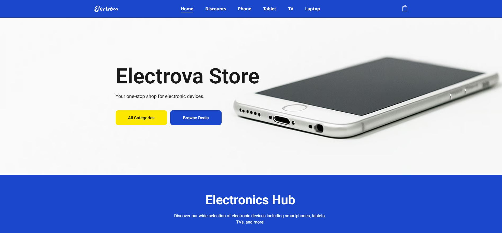 
    
This project, named 'Electrova', is an electronics-focused webshop developed using WordPress. Users can browse and purchase a variety of electronic devices, including smartphones, smart TVs, tablets, and laptops. The website features highlighted discounts and showcases imported products in a clean, visually appealing format, presenting only the most essential information. Simple animations enhance the overall user experience. The individual product pages are also well-structured and visually refined, offering image galleries, option and quantity selectors, as well as detailed descriptions.

    <h2>Features</h2>
    <ul>
      <li>Responsive and mobile-friendly design</li>
      <li>Product filtering and sorting</li>
      <li>Detailed product pages with specs</li>
      <li>Image gallery and variation selector</li>
      <li>Interactive shopping cart sidebar</li>
      <li>Live discount countdown timer</li>
      <li>Highlight tags (e.g. Sale, New)</li>
      <li>Similar and discounted product sections</li>
      <li>Quick category navigation</li>
      <li>Clean UI with flexbox/grid layout</li>
    </ul>       
    <h2>Tech Stack</h2>  
    
Platform: WordPress
   
    <h2>Landing Page Sections</h2> 
    <h3>Welcome, Hub, Why Choose Us & Footer </h3>
    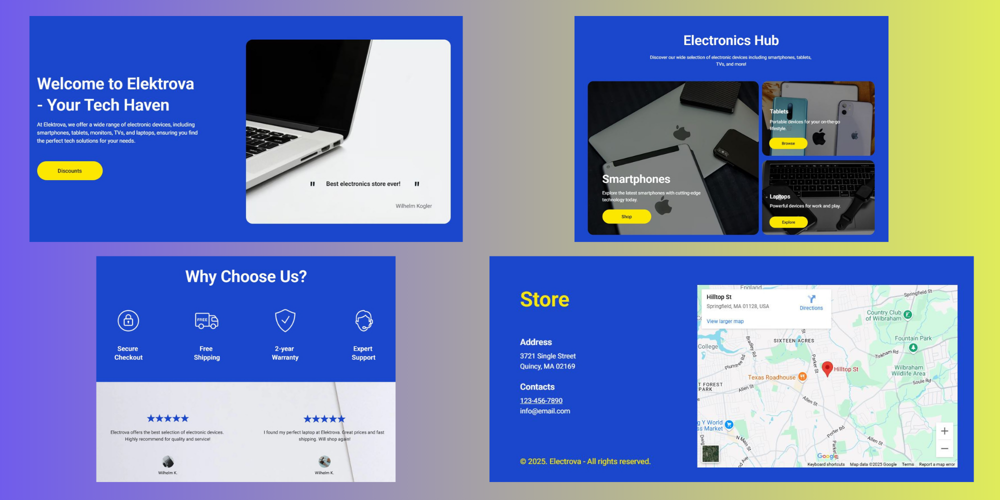    
    
- Welcome Section  The homepage greets users with a welcoming message and a clean, modern design. It highlights the brand "Elektrova – Your Tech Haven" and introduces the store's wide selection of electronic devices. A prominent "Discounts" button encourages users to explore current deals.

    
- Electronics Hub This section provides quick access to the main product categories such as Smartphones, Tablets, and Laptops, displayed in a neat flexbox layout with accompanying images. Each category includes a short description and a clear call-to-action button like "Browse", "Shop", or "Explore".

    
- Why Choose Us?  This part emphasizes the store’s key benefits: Secure Checkout / Free Shipping / 2-Year Warranty / Expert Support. Below the icons, there are customer testimonials with 5-star ratings, enhancing credibility and trust in the service.

    
- Footer Section  The footer includes the store’s physical address, contact details, and a Google Maps embed showing the store location. It also displays a copyright notice.

    <h3>Best Deals & All Products</h3>
    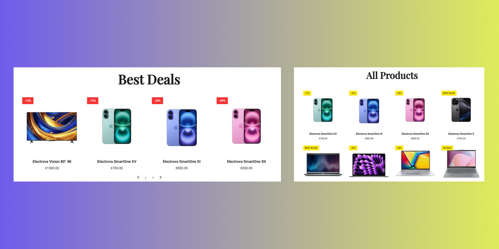    
    
- Best Deals Section   This section features a carousel layout showcasing the best current deals on popular products. Each product card includes a discount label (e.g., -10%, -40%) and displays the product image, name, and price. The layout is responsive and uses Flexbox for consistent alignment. Users can navigate between multiple deal pages using pagination controls below the product row.

    
- All Products Section   The "All Products" section provides a complete overview of the available electronic devices. Products are displayed in a grid format, each accompanied by a name, price, and promotional badge (e.g., BEST VALUE, ON SALE, BEST SELLER). Color-coded tags highlight different types of offers and make it easy for users to spot popular or discounted items.

    <h2>Browsing Products</h2>  
    <h3>Smartphones</h3>
    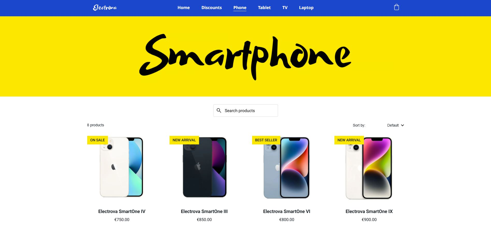    
    <h3>Tablets</h3>
    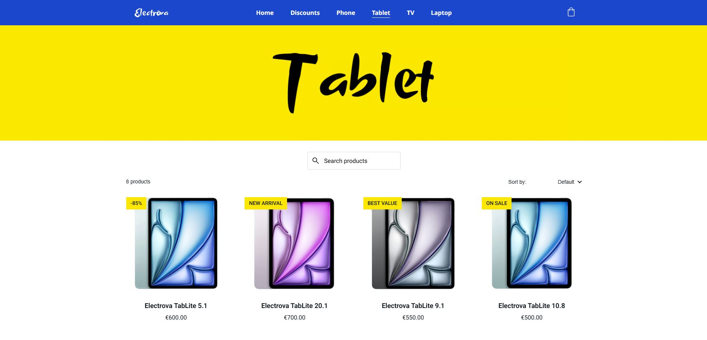    
    <h3>Smart TVs</h3>
    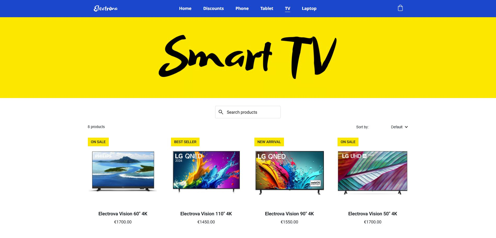    
    <h3>Laptops</h3>
    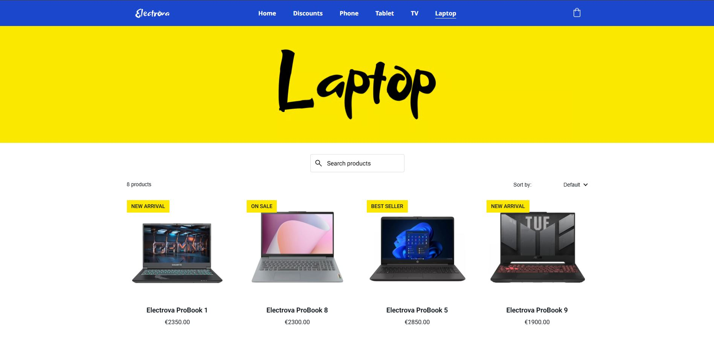    
    
Each main product category in the webshop has its own dedicated page with a vibrant yellow banner and a bold, handwritten-style title like Smart TV, Smartphone, Tablet, or Laptop. These pages provide a clean and user-friendly layout, making it easy for customers to browse and find what they need. At the top of each section, users can search for products or sort them by different criteria using a dropdown menu.    Products are presented in a consistent grid layout that highlights the item name, high-quality image, and price. To improve the shopping experience, several promotional tags are used, such as ON SALE, NEW ARRIVAL, BEST SELLER, and BEST VALUE, helping users quickly spot discounts or featured items. The visual design is modern and intuitive, ensuring a smooth and enjoyable browsing experience across all categories.

    <h3>Discounts</h3>
    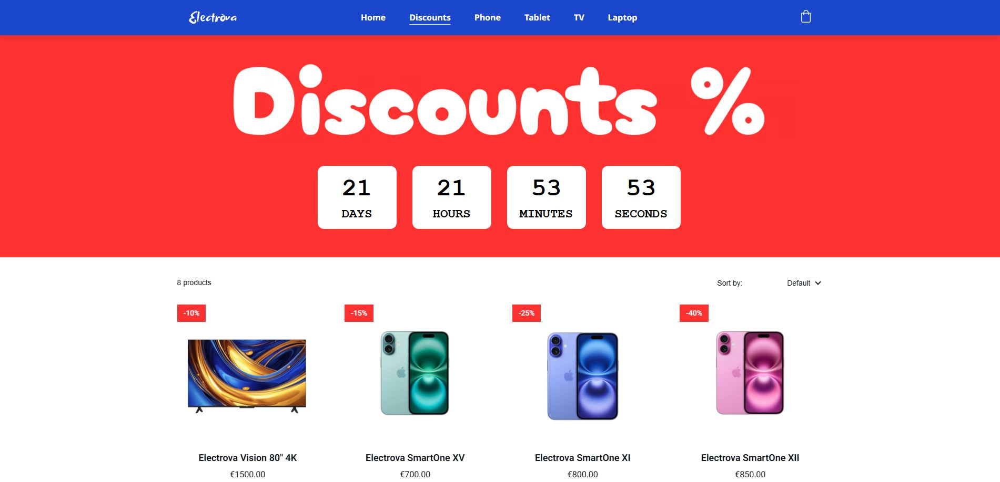    
    
The Discounts page features a bold and eye-catching red banner with the word "Discounts %", immediately drawing attention to ongoing sales. Just below the banner, there is a live countdown timer showing the time left until the current promotion ends, displayed in days, hours, minutes, and seconds. This creates a sense of urgency and encourages users to take advantage of the deals quickly.

    <h3>Product Sections</h3>
    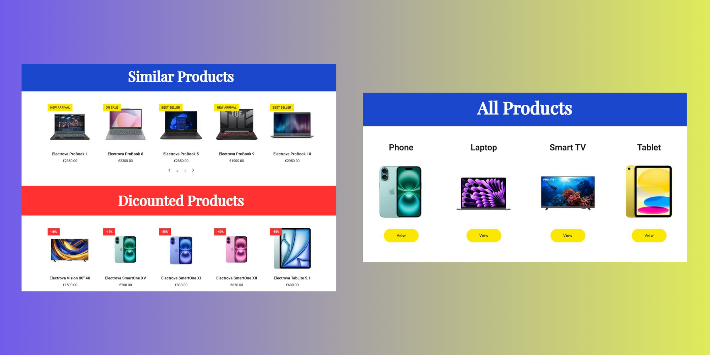    
    
At the bottom of each product category page, after scrolling past the listed items, users can find two consistent sections: Similar Products and Discounted Products. The Similar Products section showcases related items from the same category with badges like NEW ARRIVAL or BEST SELLER, while the Discounted Products section highlights current deals across the store with clear percentage labels.

    
Additionally, a quick-access All Products area helps users navigate between main categories (Phone, Laptop, Smart TV, Tablet) with image previews and “View” buttons for each.

    <h2>Product View</h2>
    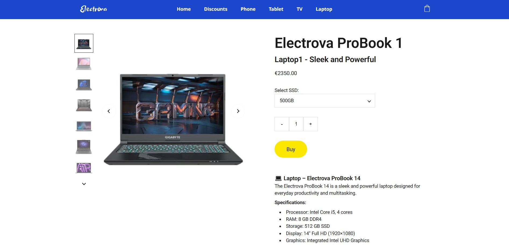
    
The product page provides a clean and detailed view of each item. On the left, users can browse through additional product images using a vertical image carousel. The main image is prominently displayed in the center for better visibility.

    
On the right, the product name, short description, and price are clearly shown. Users can select product variations, such as SSD size, from a dropdown menu, and adjust the quantity with plus and minus buttons before clicking the bright yellow Buy button.

    
Below the main info, a short product description is followed by a Specifications section listing key technical details like processor, RAM, storage, display, and graphics. This layout ensures that all essential information is easily accessible at a glance.

    <h2>Shopping Bag</h2>
    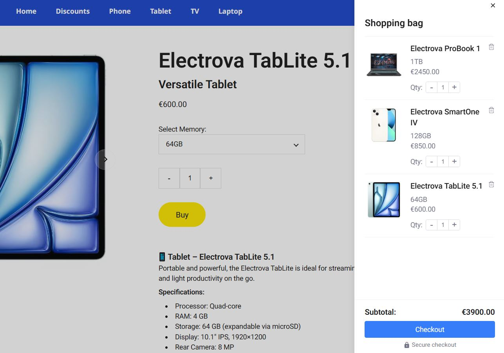  
    
When a user adds a product to the cart, a shopping bag sidebar slides in from the right, providing a clear overview of selected items. Each product entry includes the name, variant (e.g., memory size), price, and quantity controls with plus and minus buttons.
 
    
At the bottom, the subtotal is dynamically updated, and a prominent Checkout button allows the user to proceed with a secure purchase. This cart design ensures a smooth and efficient shopping experience without navigating away from the product page.
 
    <h2>Responsive Design</h2>
    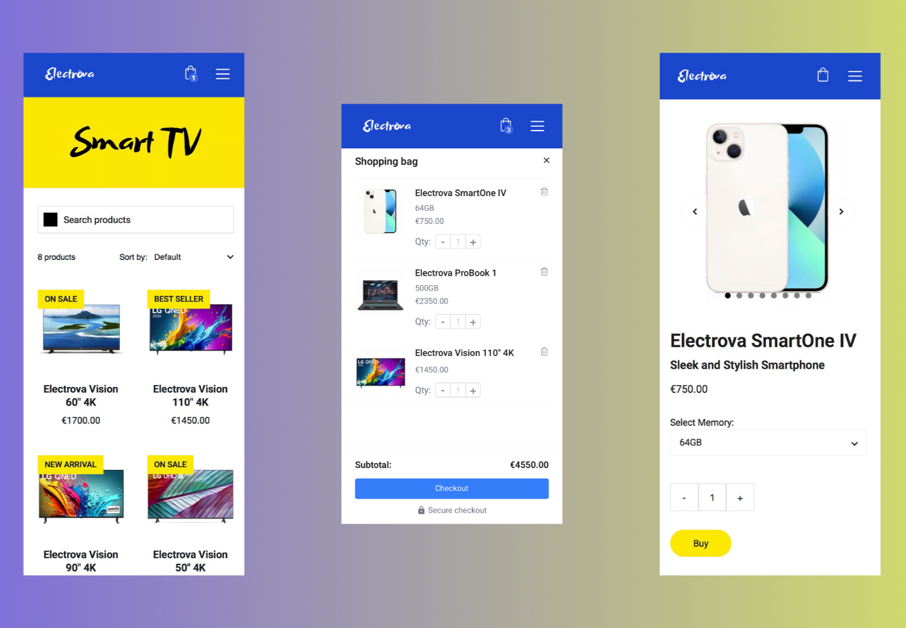 
    
The webshop features a fully responsive design, ensuring a smooth and user-friendly experience on mobile devices. Product category pages are neatly stacked for vertical scrolling, with clear labels like ON SALE or BEST SELLER remaining visible even on smaller screens. Filters and sorting options are accessible via dropdown menus for ease of use.

    
The shopping bag can be opened as a sidebar, optimized for touch interaction, showing products, quantities, prices, and a sticky Checkout button at the bottom.

    
Individual product pages are also mobile-optimized, with swipeable image carousels, dropdowns for selecting variations (e.g. memory size), and intuitive quantity selectors. The Buy button remains prominent and easy to tap, improving the shopping experience on the go.

    <h2>Preview Website</h2>
    <a href="https://elektrova-avl7dvvvqqsj319g.builder-preview.com" target="_blank">Open</a>
  
    
    
